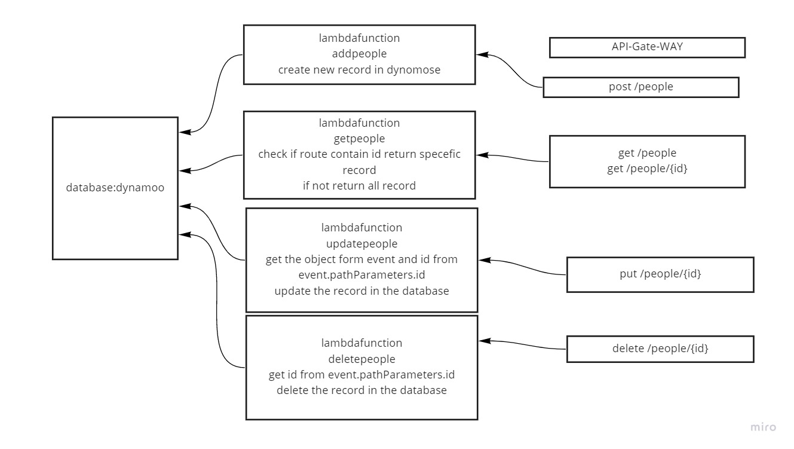

# api-dynamo-lambda

[link](https://krnnngmp5j.execute-api.us-east-1.amazonaws.com/people)

database
{
    id:"string",
    name:"string"
}
id generate by uuid backage

## EndPoints

`GET` people => get all records in database
`GET` people/{id} => get the record with the id from database
`post` people => create new record in database
`put` people/{id} => update record with the id fron database
`delete` people/{id} => delete the record with the id fron database

